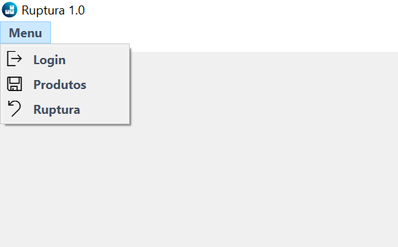
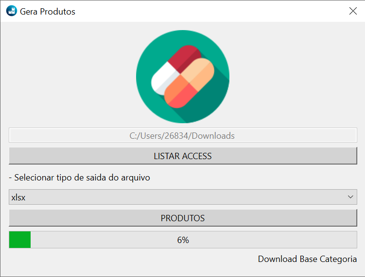

# Sistema de Integração e Relatórios de Ruptura de Estoque

## Descrição

Este projeto é um aplicativo desktop desenvolvido em **Python** utilizando o framework **PySide6** (Qt para Python). O sistema integra diversos bancos de dados no formato **ACCDB** (Microsoft Access) e utiliza o **AWS Athena** para consultas sobre categorias de produtos. Ele gera relatórios detalhados sobre a **ruptura de estoque** em lojas.

## Funcionalidades

- **Integração com bancos de dados ACCDB**: Conecta e extrai dados de múltiplos arquivos de banco de dados no formato Microsoft Access (.accdb).
- **Consulta com AWS Athena**: Faz uso do serviço AWS Athena para retornar informações relacionadas às categorias de produtos, utilizando SQL diretamente em dados armazenados no **S3**.
- **Análise de Ruptura de Estoque**: Processa os dados dos bancos para identificar produtos com estoque insuficiente ou em ruptura.
- **Geração de Relatórios**: Cria relatórios detalhados em formatos como PARQUET, Excel ou CSV sobre as rupturas identificadas.
- **Interface Gráfica Intuitiva**: Interface amigável.

## Tecnologias Utilizadas

- **Python**: Linguagem de programação principal.
- **PySide6**: Para a criação da interface gráfica (GUI).
- **AWS Athena**: Para consulta de categorias de produtos.
- **pyodbc**: Para conexão com bancos de dados ACCDB.
- **pandas**: Para manipulação e análise de dados.

    
    

